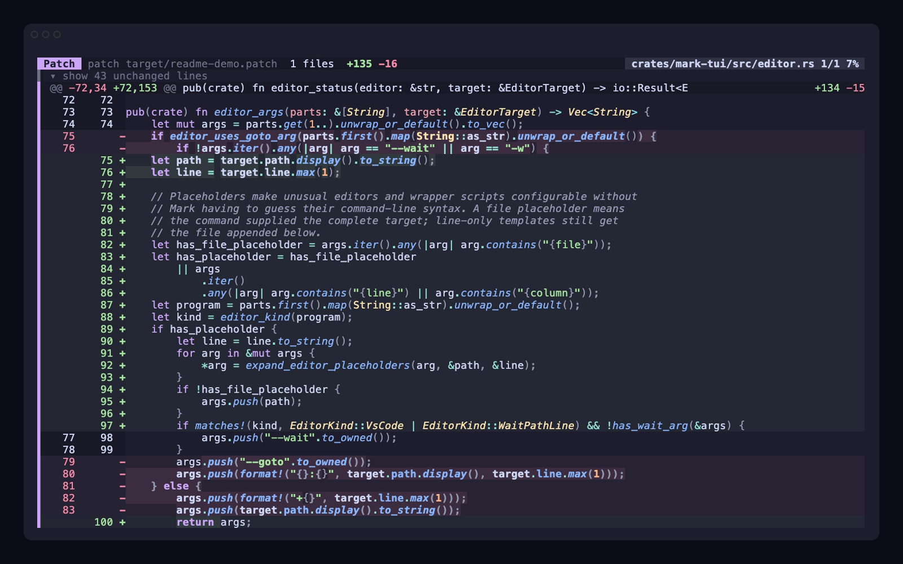

# mark

[](https://github.com/phongndo/mark/actions/workflows/quality.yml)
[](https://github.com/phongndo/mark/releases/latest)
[](LICENSE)

`mark` is a fast, keyboard-first terminal Git diff reviewer. It opens local
changes, commits, patches, pager input, difftool pairs, and GitHub pull requests
in the same focused review UI.

<p align="center">
  
</p>

<p align="center">
  <sub>A focused Rust change in Mark, rendered in Catppuccin Mocha. Reproduce it with <a href="docs/assets/readme-demo.tape">this VHS tape</a>.</sub>
</p>

## What it does

- **Review any changeset.** Open the worktree, revision ranges, commits, patch
  files, stdin, difftool pairs, or a GitHub pull request by number or URL.
- **Move without waiting.** Jump between files, hunks, matches, the top, or the
  bottom while rendering only the visible viewport.
- **Find the relevant change.** Filter files, grep the diff, expand context, or
  switch from hunks to the full file without leaving the reviewer.
- **Leave review context.** Add inline annotations one at a time or use sticky
  batch annotation mode across the visible viewport.
- **Work the way you want.** Toggle split and unified layouts, choose a built-in
  or custom theme, customize keybindings, and open the focused code in your
  editor.
- **Fit into Git.** Use Mark directly, as `core.pager`, or as a Git difftool.
  Local worktree sessions can watch for changes and reload in place.

## Install

The supported install path is the shell installer for macOS and Linux on
`aarch64` and `x86_64`:

```sh
curl -fsSL https://raw.githubusercontent.com/phongndo/mark/main/scripts/install.sh | sh
```

Homebrew, mise, Cargo, and other package-manager installs are deprecated for
now. Reinstall with the command above if you used one of those paths before.

Installer environment variables use the `MARK_` prefix:

```sh
curl -fsSL https://raw.githubusercontent.com/phongndo/mark/main/scripts/install.sh | MARK_VERSION=0.10.6 sh
curl -fsSL https://raw.githubusercontent.com/phongndo/mark/main/scripts/install.sh | MARK_INSTALL_DIR=/usr/local/bin sh
```

Update a curl-installed binary in place:

```sh
mark update
mark update --target-version 0.10.6
```

Nightly builds are published from `main` as a prerelease channel. Switch the
installed `mark` binary to nightly, then back to stable, with:

```sh
curl -fsSL https://raw.githubusercontent.com/phongndo/mark/main/scripts/install.sh | MARK_VERSION=nightly sh
mark update
```

Once on stable, switch to nightly again with:

```sh
mark update --target-version nightly
```

Nightly binaries report their channel and build commit in `mark --version`.

## Quick start

```sh
mark                         # review current worktree changes
mark diff --base main        # review current branch against main
mark diff main feature       # review a revision range
mark show HEAD~1             # review one commit
mark review 123              # review GitHub PR #123 from the current repo
mark patch changes.diff      # review an existing patch file
git diff | mark pager        # use mark as a diff pager
```

Plain `mark` is a shortcut for `mark diff`. While reviewing, use `a` or `A` to
add annotations, `y` to copy them, and `Shift-Q` to copy the annotations and
quit (`q` quits without submitting them).

## Built for huge diffs

Mark keeps the hot path viewport-bounded instead of rebuilding the entire
screen model for every action. That matters on ordinary reviews, and it keeps
navigation responsive when a generated change or pull request becomes enormous.

A committed Apple Silicon reference run measured the synthetic one-million-row
diff fixture as follows:

| Diff | Load | Open | Grep | Random-scroll max | RSS increase |
| --- | ---: | ---: | ---: | ---: | ---: |
| 1,000,000 rows / 74.0 MB | 20.6 ms | 20.8 ms | 68.0 ms | 87 µs | 112 MB |

These are reference-machine benchmark results, not latency promises for every
machine or repository. The fixture, commands, memory accounting, and 10-million-
row local run are documented in the
[mega-diff performance report](docs/performance-reports/2026-07-11-mega-diff-memory.md).

## How it compares

These tools solve related but different problems. Mark and
[Hunk](https://github.com/modem-dev/hunk) are interactive reviewers,
[delta](https://github.com/dandavison/delta) is primarily a syntax-highlighting
pager, and [Difftastic](https://github.com/Wilfred/difftastic) is a structural
diff engine.

| Built-in capability | Mark | Hunk | delta | Difftastic |
| --- | :---: | :---: | :---: | :---: |
| Interactive multi-file review UI | Yes | Yes | — | — |
| Split / side-by-side view | Yes | Yes | Yes | Yes |
| Runtime layout switching | Yes | Yes | — | — |
| Inline review annotations | Yes | Yes | — | — |
| Live worktree or file reload | Yes | Yes | — | — |
| File filtering | Yes | Yes | — | — |
| In-diff text search | Yes | — | — | — |
| Direct GitHub pull request review | Yes | — | — | — |
| Git pager workflow | Yes | Yes | Yes | — |
| Git difftool / external-diff workflow | Yes | Yes | — | Yes |
| Native Jujutsu and Sapling detection | — | Yes | — | — |
| Structural, syntax-aware diff algorithm | — | — | — | Yes |
| Syntax highlighting | Yes | Yes | Yes | Yes |

The table compares documented, built-in workflows. Each tool can be composed
with other Git and shell commands beyond what is listed here.

## Git integrations

Use `mark pager` as a Git pager for `git diff` and `git show` output:

```sh
git config --global core.pager "mark pager"
```

Use `mark difftool` as a Git difftool for Git-provided file pairs:

```sh
git config --global diff.tool mark
git config --global difftool.mark.cmd 'mark difftool -- "$LOCAL" "$REMOTE" "$MERGED"'
```

## Pi extension

This repository includes a separate `pi-mark` Pi package. It adds a `/mark`
command to Pi and shells out to an already-installed `mark` binary. It does not
bundle the CLI.

```sh
pi install npm:pi-mark

The slash command moved from `/diff`, `/show`, and `/patch` to `/mark` with
subcommands (`/mark diff`, `/mark show`, `/mark patch`). `PI_DX_BIN` is now
`PI_MARK_BIN`.

See [`pi-mark/README.md`](pi-mark/README.md) for package usage and development.

## Documentation

- [Usage](docs/usage.md) - commands, diff sources, pager, difftool, and GitHub
  reviews.
- [Configuration](docs/configuration.md) - config paths, syntax settings,
  colors, diff rendering, and keybindings.
- [Development](docs/development.md) - setup, checks, release flow, and local
  Pi package work.
- [Contributing](CONTRIBUTING.md) - repository standard and PR expectations.

## Development

Use the Nix shell when available:

```sh
nix develop
just check
```

Without Nix, install the Rust toolchain from `rust-toolchain.toml` and run:

```sh
cargo fetch --locked
cargo build -p mark-cli --locked
cargo fmt --all --check
cargo clippy --workspace --all-targets --all-features --locked -- -D warnings
cargo test --workspace --all-targets --all-features --locked
```

## Workspace layout

```text
crates/mark-cli       command parsing, update, and CLI UX
crates/mark-command   command facade shared by CLI and future integrations
crates/mark-core      shared errors and path helpers
crates/mark-git       low-level Git process boundary
crates/mark-diff      diff loading, parsing, and plain rendering
crates/mark-syntax    syntax config, language selection, and highlighting boundary
crates/mark-tui       ratatui/crossterm diff review UI
crates/mark-bench     local benchmark fixture generation
pi-mark               Pi extension package published to npm
```

## License

MIT. See [LICENSE](LICENSE).
