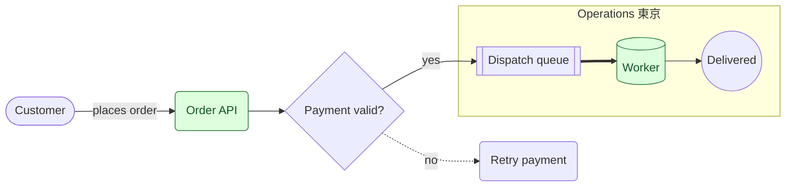

# Checkout overview

The service accepts “café” orders and ships them worldwide 🚀.

```mermaid
flowchart LR
  browser([Customer]) -->|places order| api@{ shape: rounded, label: "Order API" }
  api --> decision{Payment valid?}
  decision -->|yes| queue[[Dispatch queue]]
  decision -.->|no| retry(Retry payment)
  subgraph ops["Operations 東京"]
    direction TB
    queue ==> worker[(Worker)]
    worker --> done((Delivered))
  end
  classDef healthy fill:#dfd,stroke:#273,color:#152
  class api,worker healthy
  click api href "https://example.test/orders" "Open orders"
```

The diagram keeps the failure path visible without obscuring the main flow.
