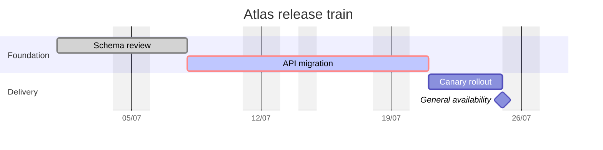
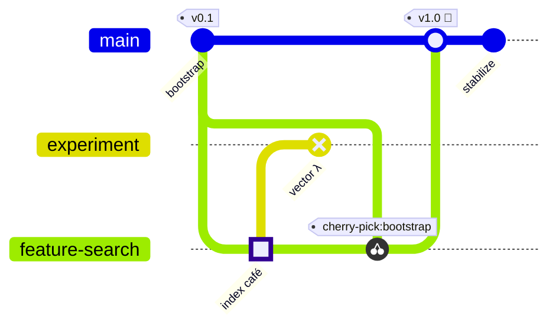
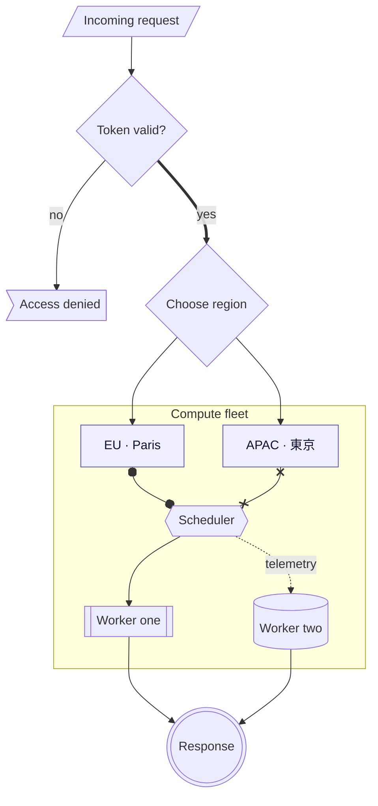
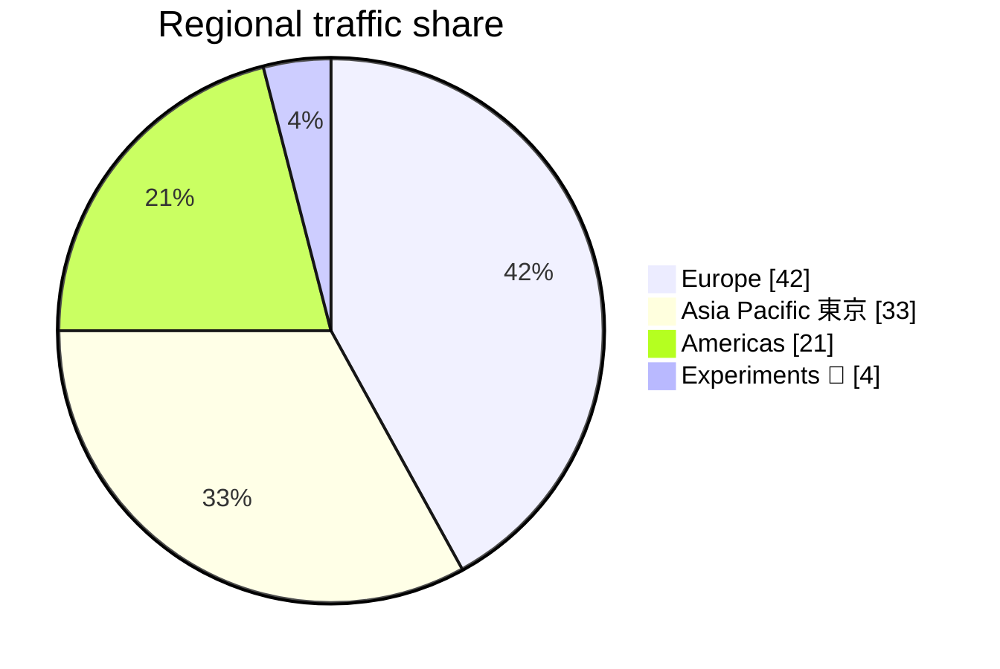
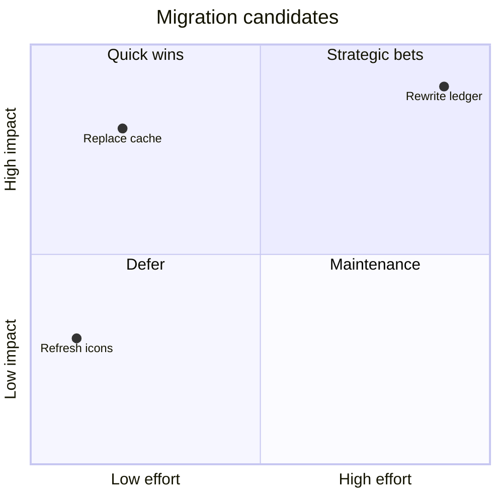
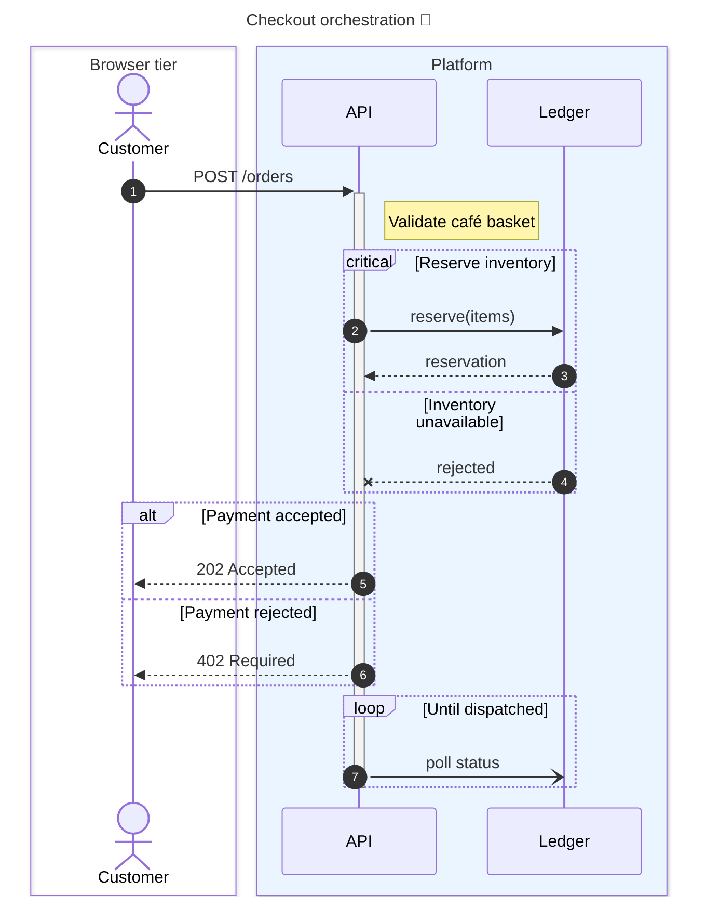
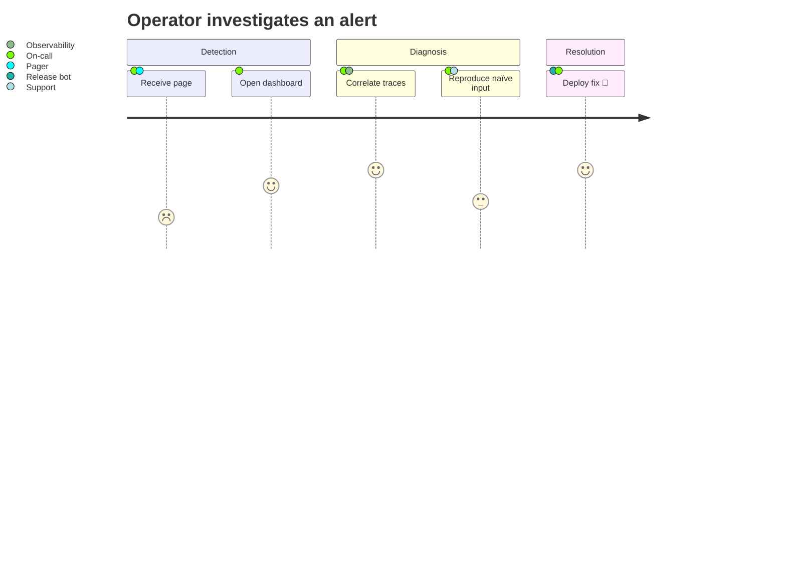
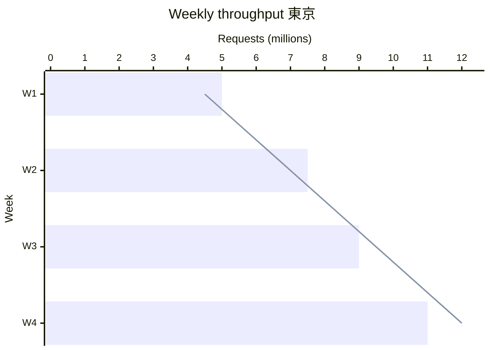

# Atlas platform diagrams
These hand-maintained views describe the same deployment from complementary angles. Labels intentionally include naïve, 東京, λ, and 🚀.
```mermaid architecture
architecture-beta
  %% Regional topology
  group edge(cloud)[Edge Layer]
  group core(server)[Core Platform]
  service dns(internet)[Global DNS] in edge
  service gateway(server)[API Gateway] in edge
  service ledger(database)[Ledger] in core
  junction ingress in edge
  dns:R --> L:ingress
  ingress{group}:B --> T:gateway
  gateway:R <--> L:ledger
```
~~~mermaid
classDiagram
  %% Domain model with generic and visibility forms
  class Order~T~ {
    +String id
    #List~T~ items
    -Money total
    +addItem(T item) Order~T~
    +checkout(Payment payment)$ Receipt
  }
  class Receipt
  <<service>> CheckoutService
  Order "1" *-- "1..*" LineItem : contains
  CheckoutService ..> Order : validates
  Customer --> Order : places
  Order : +cancel(String reason) bool
  Receipt : String confirmation
~~~
```{.mermaid data-view=storage}
erDiagram
  %% Logical storage model
  CUSTOMER ["Account owner"] {
    uuid id PK "stable identifier"
    string display_name "Unicode résumé"
    string email UK
  }
  ORDER {
    uuid id PK
    uuid customer_id FK
    decimal total
  }
  LINE_ITEM {
    uuid order_id PK, FK
    string sku PK
  }
  CUSTOMER ||--o{ ORDER : "places orders"
  ORDER ||--|{ LINE_ITEM : contains
```







~~~mermaid theme=neutral
mindmap
  root((Atlas knowledge))
    Product
      (Roadmap)
      [Research]
        λ calculus
        Unicode 日本語
    Operations
      {{Reliability}}
        On-call
        Postmortems:::urgent
          ::icon(fa fa-fire)
    Community
      Contributors 🚀
~~~





```mermaid
requirementDiagram
  requirement availability {
    id: SLO-001
    text: Serve 99.95 percent of requests
    risk: high
    verifymethod: analysis
  }
  performanceRequirement latency {
    id: PERF-007
    text: Complete checkout within 300 ms
    risk: medium
    verifymethod: test
  }
  element gateway {
    type: service
    docref: adr-042
  }
  gateway - satisfies -> availability
  latency <- verifies - gateway
```



::: mermaid
stateDiagram-v2
  direction LR
  [*] --> Idle : boot
  state "Waiting for work" as Idle
  Idle --> Running : dequeue
  state Running {
    [*] --> Validating
    Validating --> Charging : valid
    Charging --> Packing : paid
    Packing --> [*]
  }
  state fork_state <<fork>>
  Running --> fork_state
  fork_state --> Audit
  fork_state --> Notify
  state join_state <<join>>
  Audit --> join_state
  Notify --> join_state
  join_state --> Complete
  note right of Running
    Spans multiple lines with 東京.
    The rule closes at end note 🚀.
  end note
  Complete --> [*]
:::





Each fence closes before the next Markdown section so embedded parser state cannot leak between diagram families.
